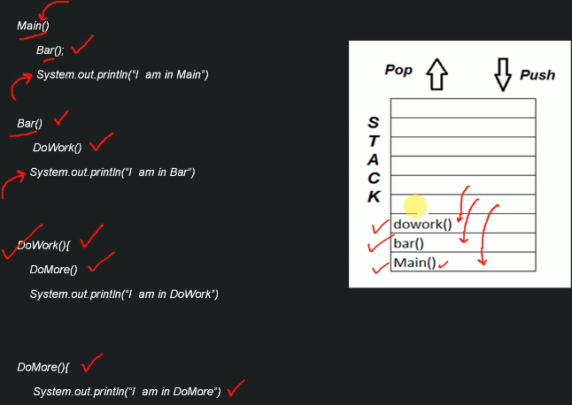

# Data Structure

- Systematic way of organizing and accessing data

# Algorithm

- step by step procedure for performing some task in a finite amount of time
- what can affect the running time of algorithm?
  - input size
  - hardware: processor, clock rate,
  - OS
- Goal: characterize algorithms running time as a function of input size
- I can use a time function to track start and stop of algorithm
- better I can keep track of clock cycles
- timeit python module
- limitations of experimental analysis:
  - limited to same hardware and software specs
  - time will vary depending on machine
  - for fast algorithms speed measurements may bot be precise enough
  -
- what does better mean?
  - Faster
  - less memory intensive
  - more readable

# Big O

- `Run time analysis`

      Study of a given algorithm's running time, by identify its behavior as the input size increases. How much time will the given algorithm take to run as input size increases.

- `Why learn it`

      To measure efficiency of the given algorithm

- allows us to evaluate the algo independent of hardware and software environments
- does not require implementation of algorithm --> only a high level understanding
- takes into account all possible inputs
- Big O way of comparing code and its performance to other pieces of code
- this gives a numeric representation of how code may perform
- Useful in discussing trade-offs between different approaches
- When code slows down and crashes, identify parts of the code that inefficient can help us find pin points in our application
- we can count number of simple operations

  - \*, +, -, /
  - numbers will be constant time

- `Notations used`

  1.  Omega()

      - gives lower bound of algorithm
      - For any given input the running time of a given algorithm will not be less than given time.

  2.  BigO

      - Gives the tighter upper bound of algorithm
      - For any given input the running time of a given algorithm will not be more than given time

  3.  Theta

           - decides upper and lower bound of a given algorithm if they are the same or not
           - For any given input the running time of a given algorithm will on average be equal to given time.

      

  4.  Best Case
  5.  Worst Case
  6.  Average Case

## Constant time

- Primitive operations

## Asymptotic Analysis

- focus on the growth rate of the running time as a function of the input size n
- regardless of the exact number, the number of operations grows roughly with n
- formal way to keep track of number of operations
- we don't care about the details, only the trends

- talking about the worst case scenario, the upper bound
- An algorithm is O(f(n)) if the number of simple operations the computer has do is eventually less than a constant times f(n), as n increases
- f(n) could be linear (f(n) = n)
- f(n) could be quadratic (f(n) = n )
- f(n) could be constant (f(n) = 1) : We can remove these since they won't impact time when we are talking about it in "n" units of time. "n" could be in billions.
- f(n) could be something entirely different!

  

- for loops are O(n)
- nested for loops could be O(n^2)

- space complexity

  - how much additional memory do we need to allocate in order to run the code in our algorithm?
  - Sometimes you'll hear the term auxiliary space complexity to refer to space required by the algorithm, not including space taken up by the inputs.
  - Most primitives (booleans, numbers, undefined, null) are constant space
  - Strings require O(n) space (where n is the string length)
  - Reference types are generally O( n), where n is the length (for arrays) or the number of keys (for objects)

  - LOGS
    - log2(value) = exponent ----> 2^exponent = value
    - some search, sort, recursion algorithms have log time complexity

  ### RULES

  - Constants Don't matter
  - Smaller terms don't matter
  - Arithmetic operations are constant
  - Variable assignment is constant
  - Accessing elements in an array (by index) or object (by key) is constant
  - In a loop, the the complexity is the length of the loop times the complexity of whatever happens inside of the loop

# Objects

1. when to use objects

   - When you don't need order
   - When you need fast access / insertion and removal

2. Object.keys - O(N)
3. Object.values - O(N)
4. Object.entries - O(N)
5. hasOwnProperty - O(1)

# Arrays

- When you need order
- When you need fast access / insertion and removal (sort of....)
- push - O(1)
- pop - O(1)
- shift - O(N) - removes from the front
- unshift - O(N) - add to the front
- concat - O(N)
- slice - O(N)
- splice - O(N)
- sort - O(N \* log N)
- forEach/map/filter/reduce/etc. - O(N)

# Problem Solving Patterns

An algorithm: a series of steps to accomplish a task

### Improve Solving Problems

- Devise a plan for solving problems
- Master common problem solving patterns
- Understand the Problem
- Explore Concrete Examples
- Break It Down - what category of problems is it?
- Solve/Simplify
- Look Back and Refactor

#### Understand The Problem

1. Can I restate the problem in my own words?
2. What are the inputs that go into the problem?
3. What are the outputs that should come from the solution to the problem?
4. Can the outputs be determined from the inputs? In other words, do I have enough information to solve the problem? (You may not be able to answer this question until you set about solving the problem. That's okay; it's still worth considering the question at this early stage.)
5. How should I label the important pieces of data that are a part of the problem? -> What are the things that matter for the problem, Think if names for important pieces

`Example: Write a function which takes two numbers and returns their sum.`

    1. Restate the problem: I will be adding two numbers
        - adding two numbers
    2. What are the inputs that go into the problem?
        - are they strings, integers. Are the inputs always two?
    3. What are the inputs that should come from the solution to the problem?
        - should it be an integer, float, string..?
    4. Can the outputs be determined from the inputs?
        - Do we have enough information to solve the problem?
    5. How should I label the important pieces?
        -

#### Come up with examples to the problem. This provides a sanity check

1. Start with simple examples
2. Progress to more complicated examples
3. Explore examples with empty inputs
4. Explore examples with invalid inputs

#### Break It Down

1. Explicitly write out the steps you need to take.
   `This forces you to think about the code you'll write before you write it, and helps you catch any lingering conceptual issues or misunderstandings before you dive in and have to worry about details (e.g. language syntax) as well.`
2. Find the core difficulty in what you're trying to do
3. Temporarily ignore that difficulty
4. Write a simplified solution
5. Then incorporate that difficulty back in
6. Look back and refactor
   - Can you check the result?
   - Can you derive the result differently?
   - Can you understand it at a glance?
   - Can you use the result or method for some other problem?
   - Can you improve the performance of your solution?
   - Can you think of other ways to refactor?
   - How have other people solved this problem?

# PATTERNS

## Frequency

- This pattern uses objects or sets to collect values/frequencies of values
- This can often avoid the need for nested loops or O(N^2) operations with arrays / strings
  `Example: Write a function called same, which accepts two arrays. The function should return true if every value in the array has it's corresponding value squared in the second array. The frequency of values must be the same.`

      same([1,2,3], [4,1,9]) // true
      same([1,2,3], [1,9]) // false
      same([1,2,1], [4,4,1]) // false (must be same frequency)

## Multiple Pointers

- Creating pointers or values that correspond to an index or position and move towards the beginning, end or middle based on a certain condition

- Very efficient for solving problems with minimal space complexity as well

- I can keep track of two pointers or I can create a set and add unique values there
- O(n)
- adding to set is constant time O(1)

## SLIDING WINDOW

- This pattern involves creating a window which can either be an array or number from one position to another

- Depending on a certain condition, the window either increases or closes (and a new window is created)

- Very useful for keeping track of a subset of data in an array/string etc.

## DIVIDE AND CONQUER

- This pattern involves dividing a data set into smaller chunks and then repeating a process with a subset of data.

- This pattern can tremendously decrease time complexity

# Recursion

- a process that calls itself --> a function that calls itself with different input
- in every step we try to make the problem smaller until we get to the base case
- we can have multiple base cases
- JSON.parse / JSON.stringify
- document.getElementById and DOM traversal algorithms
- Object traversal
- Very common with more complex algorithms
- It's sometimes a cleaner alternative to iteration
- Invoke the same function with a different input until you reach your base case!
- `Recursive case:`

      1. where the function recurs, calls itself

- `Base case:`

      1. The condition when the recursion ends.
      2. This is the most important concept to understand
      3. return here to end recursion

- `Call stack:`

        1. anytime a function is invoked it is places (pushed) on top of the stack
        2. when JS sees the return keyword or when the function ends, the compiler will remove (pop)

  

- `When to use it` 1. When we can easily breakdown a problem into similar subproblem 2. when we are ok with overhead, time and space that comes with it 3. when we need a quick working solution instead if efficient

### Why Learn it

- Makes code easy to write and read compared to iterative when a problem can be broken down into similar sub-problems
- if the sub-problem is similar to big problem
  - How do I know if it is of similar type? with practice
- Used when dealing with Tree's or Graphs, Divide and Conquer, Greedy, Dynamic Programming

` What can go wrong:`

    No base case or wrong base case
    Forgetting to return or returning the wrong thing!

- Helper method recursion:

  - a function that calls itself

    `Example`

        function collectOddValues(arr){

          let result = []

          function helper(helperInput) {
              if(helperInput.length === 0) {
                  return;
              }

              if(helperInput[0] % 2 !== 0){
                  result.push(helperInput[0])
              }

              helper(helperInput.slice(1))
          }

            helper(arr)

          return result;
        }

- Tips

  - For arrays, use methods like slice, the spread operator, and concat that make copies of arrays so you do not mutate them
  - Remember that strings are immutable so you will need to use methods like slice, substr, or substring to make copies of strings
  - To make copies of objects use Object.assign, or the spread operator

  `BigO for recursion`

      Measuring time complexity is relatively simple. You can measure the time complexity of a recursive function as then number of recursive calls you need to make relative to the input

      Measuring space complexity is a bit more challenging. You can measure the space complexity of a recursive function as the maximum number of functions on the call stack at a given time, since the call stack requires memory.

      I found equation #2 and #3 by  using (n-1) and (n-2) in equation #1

      Example: s3-21

  

  
